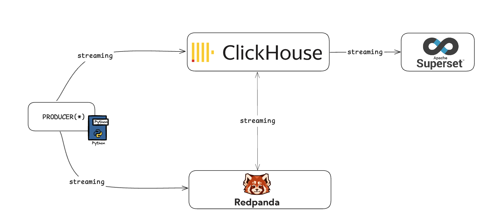

# Realtime Data Warehouse Architecture

# Env. Variables

    CLICKHOUSE_USER=<admin>
    CLICKHOUSE_PASSWORD=<password>
    CLICKHOUSE_DB=<redpanda_warehouse>

# Redpanda

Create a topic in Redpanda for ClickHouse to consume messages from.

`docker exec -it redpanda-0 rpk topic create agent-reports`

Verify that you have the topics created:

`docker exec -it redpanda-0 rpk cluster info`

# [Redpanda Console](http://localhost:8080)

# Clickhouse

      CREATE DATABASE IF NOT EXISTS redpanda_warehouse;
      
      CREATE TABLE IF NOT EXISTS redpanda_warehouse.agent_reports
      (
          agent_id UInt64,
          real_estate_map_url String,
          real_estate_type String,
          real_estate_price Float32
      ) ENGINE = Kafka()
      SETTINGS
          kafka_broker_list = 'redpanda-0:9092',
          kafka_topic_list = 'agent-reports',
          kafka_group_name = 'clickhouse-group',
          kafka_format = 'CSV';
      
      CREATE MATERIALIZED VIEW redpanda_warehouse.agent_reports_view
      ENGINE = Memory
      AS
      SELECT * FROM redpanda_warehouse.agent_reports
      SETTINGS
      stream_like_engine_allow_direct_select = 1;

# Producer

    pip install -r requirements.txt

    python3 producer.py